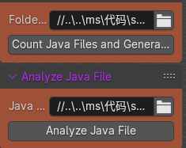
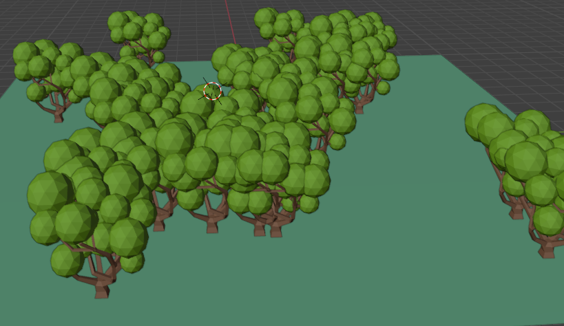
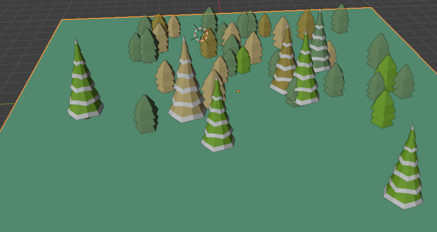

# Java_3D Project

## Project Introduction
`Java_3D` is a Java code data intelligence visualization tool based on remote sensing technology. This project utilizes Blender and Python to draw 3D graphics, aiming to help developers better understand the structure and logic of Java code.

## Key Features
- Visualizes Java code using remote sensing technology.
- Supports multi-level analysis: project level, file level, and code component level.
- Displays code complexity and structure through 3D graphics.

## Installation and Usage
### Download Blender
1. Visit the [Blender official website](https://www.blender.org/download/) to download the latest version of Blender.

### Install Blender
2. Follow the instructions for your operating system to install Blender.

### Import Scripts and 3D Models
3. Open Blender, select `File` > `Import`, then choose an .obj file to import the 3D model.
4. To run the Python script of this study, choose the `Scripting` view, click `Open` to open the Python script, then click `Run Script`.

### Run Java_3D
5. Clone the repository: `git clone https://github.com/lidiancracy/Java_3D.git`
6. Run the Python script to generate the 3D model.

### Screenshots
- **Image 1: Selecting File Path**  
  

- **Image 2: Generating Code Forest**  
  

  

## How to Contribute
Feel free to submit Pull Requests to contribute your code. You can raise issues or suggestions in the `issues` section.

## License
This project is licensed under the MIT License. For more details, see the LICENSE file.

## Contact
For any questions or suggestions, please contact me at: [837997288@qq.com]

## Acknowledgments
Thanks to all the developers and supporters who have contributed to this project.
